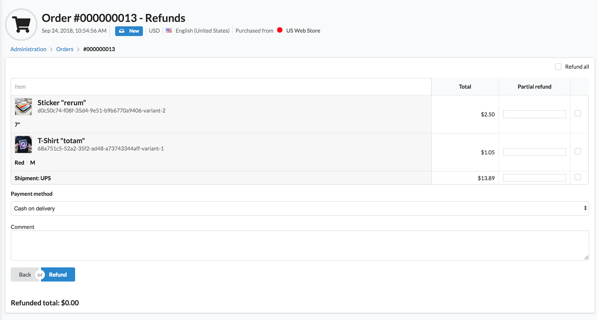
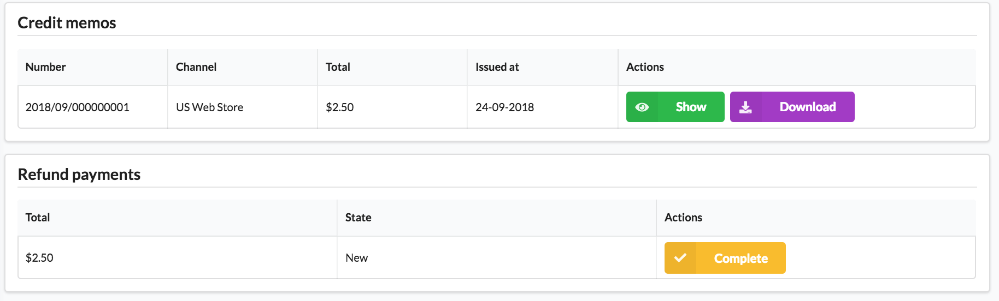

<p align="center">
    <a href="https://sylius.com" target="_blank">
        
    </a>
</p>

<h1 align="center">Refund Plugin</h1>

<p align="center"></p>

<p align="center"><a href="https://sylius.com/plugins/" target="_blank"></a></p>

<p align="center">This plugin provides basic refunds functionality for Sylius application.</p>





## Business value

In contrast to basic Refund functionality delivered by core Sylius bundles, Refund Plugin offers much wider range of
possibilities and business scenarios.

Once an Order is paid, an Administrator is able to access Refunds section of a given Order and perform a Refund
of chosen items or shipments. What's more, if a more detailed scenario occurs, an Administrator is able to refund an item
partially.

From Administrator's point of view, every Refund request results in creating two entities:
* Credit Memo - a document representing a list of refunded items (downloadable and sent to Customer via .pdf file)
* Refund Payment - entity representing payment in favour of the Customer

## Pre - requirements

In order to be able to generate PDF files of refunds, [wkhtmltopdf](https://wkhtmltopdf.org/) must be installed.
It is used by `KnpSnappyBundle` and can be configured according to [their docummentation](https://github.com/KnpLabs/KnpSnappyBundle#configuration).

## Installation

1. Require plugin with composer:

    ```bash
    composer require sylius/refund-plugin:1.0.0-RC.7
    ```

    > Remember to allow community recipes with `composer config extra.symfony.allow-contrib true` or during plugin installation process

2. Apply migration to your database:

    ```bash
    bin/console doctrine:migrations:migrate
    ```

3. Copy Sylius templates overridden in plugin to your templates directory (e.g `templates/bundles/`):

    ```bash
    mkdir -p templates/bundles/SyliusAdminBundle/
    cp -R vendor/sylius/refund-plugin/src/Resources/views/SyliusAdminBundle/* templates/bundles/SyliusAdminBundle/
    ```
   
4. If you use Sylius v1.8 you also need to change files `src/Entity/Shipping/Shipment.php` and `src/Entity/Order/Adjustment.php` to use proper traits and interfaces:

    ```php
    <?php
    
    declare(strict_types=1);
    
    namespace App\Entity\Order;
    
    use Doctrine\ORM\Mapping as ORM;
    use Sylius\Component\Order\Model\Adjustment as BaseAdjustment;
    use Sylius\RefundPlugin\Entity\AdjustmentInterface as RefundAdjustmentInterface;
    use Sylius\RefundPlugin\Entity\AdjustmentTrait;
    
    /**
    * @ORM\Entity
    * @ORM\Table(name="sylius_adjustment")
    */
    class Adjustment extends BaseAdjustment implements RefundAdjustmentInterface
    {
        use AdjustmentTrait;
    }
   ```
   
    ```php 
    <?php
    
    declare(strict_types=1);
    
    namespace App\Entity\Shipping;
    
    use Doctrine\Common\Collections\ArrayCollection;
    use Doctrine\ORM\Mapping as ORM;
    use Sylius\Component\Core\Model\AdjustmentInterface as BaseAdjustmentInterface;
    use Sylius\Component\Core\Model\Shipment as BaseShipment;
    use Sylius\RefundPlugin\Entity\ShipmentTrait;
    use Sylius\RefundPlugin\Entity\ShipmentInterface as RefundShipmentInterface;
    
    /**
    * @ORM\Entity
    * @ORM\Table(name="sylius_shipment")
    */
    class Shipment extends BaseShipment implements RefundShipmentInterface
    {
        use ShipmentTrait;
    
        public function __construct()
        {
            parent::__construct();

            /** @var ArrayCollection<array-key, BaseAdjustmentInterface> $this->adjustments */
            $this->adjustments = new ArrayCollection();
        }
    }
    ```

#### Beware!

This installation instruction assumes that you're using Symfony Flex. If you don't, take a look at the
[legacy installation instruction](docs/legacy_installation.md). However, we strongly encourage you to use
Symfony Flex, it's much quicker! :)

## Extension points

Refund Plugin is strongly based on both commands and events. Let's take RefundUnitsAction as an example. The whole
process consists of following steps:

* Getting data from request
* Create a Command and fill it with data
* Dispatch Command
* Handle Command
* Fire Event
* Catch Event in Listener class

Using command pattern and events make each step independent which means that providing custom implementation of given
part of refunding process doesn't affect any other step.

Apart from Events and Commands Refund Plugin is also based on mechanisms derived from core Sylius bundles such as:

* [Resources](https://docs.sylius.com/en/1.2/components_and_bundles/components/Resource/index.html)
* [Grids](https://docs.sylius.com/en/1.2/components_and_bundles/bundles/SyliusGridBundle/index.html)
* [State Machine](https://docs.sylius.com/en/1.2/book/architecture/state_machine.html)

Configuration of all elements mentioned above can be found and customized in `config.yml` file.

## Payment requirements

By default to refund your order, you need to have at least one available payment method configured with `offline` gateway.
In case your custom refund logic allows a different type of gateway (for example `stripe`), you should modify the specific parameter,
as shown below:

   ```xml
        <parameters>
            <parameter key="sylius_refund.supported_gateways" type="collection">
                <parameter>offline</parameter>
                <parameter>stripe</parameter>
            </parameter>
        </parameters>
   ```

Online refund logic should be implemented if you need it.
As the first try for the possible customization, you can check out `Sylius\RefundPlugin\Event\UnitsRefunded` event.

## Security issues

If you think that you have found a security issue, please do not use the issue tracker and do not post it publicly.
Instead, all security issues must be sent to `security@sylius.com`.
